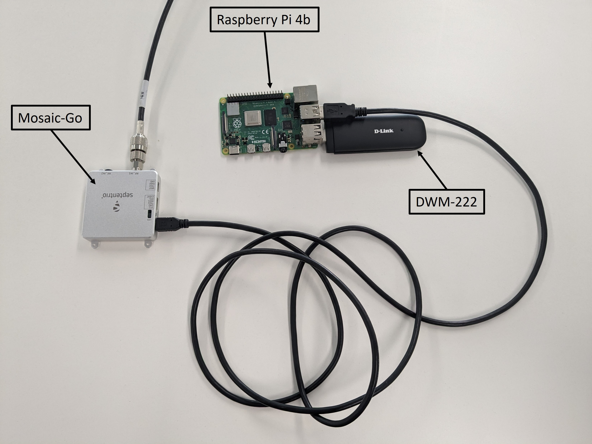

  
  

# Septentrio SUPL-3GPP-LPP-client
This repository is a fork from the [SUPL-3GPP-LPP-client](https://github.com/Ericsson/SUPL-3GPP-LPP-client) made by Ericsson. It contains additional support for Septentrio GNSS receiver to provide location data information.

---

## Objective
The primary goal of this repository is to facilitate the use of the LPP protocol over SUPL with a Septentrio GNSS receiver, facilitating the delivery of OSR RTCM corrections.

## Getting Started
To get started with the SUPL-3GPP-LPP-client and a Septentrio receiver, follow the [getting started](getting_started.md) guide.

This guide contains instruction on how to build and use the client as well as instructions on how to set up the receiver and modem.

## Tested Setup
The following setup was tested and is confirmed to work with the 3GPP LPP client.
- SBC : Raspberry Pi 4B (OS: Raspberry PI OS 64bit - 2023/05/03)
- GNSS Receiver : Septentrio Mosaic-Go
- Modem : D-Link DWM-222 (HW Ver: A2, SW Ver: 2.0.1 EU) 

  

## What is SUPL ?
The SUPL (Secure User Plane Location) protocol is an IP protocol designed to transmit essential information for Assisted GPS (A-GPS) over a mobile network.

## What is LPP ?
LTE positioning protocol (LPP) is a point-to-point protocol that allows multiple connections to different devices and is used to position the target device.
LPP provides support for GNSS based positioning, network based positioning and hybrid – a combination of both GNSS and network based positioning.

## Client

SUPL-3GPP-LPP-client is an example client for connecting requesting assistance data from a location server using 3GPP LPP (Release 16.4) over SUPL. The client includes a handful of libraries that can be used to build a more feature rich and fully functioning client, that for example communications with a GNSS receiver to estimate a precise position. 

The default configuration of the example client is to connect to the location server using the provided ECGI and request assistance data (for OSR). Data received will be converted to RTCM that can be used with legacy devices. Requesting SSR corrections is supported but requires defining SSR=1 when building, the RTCM converter cannot be used with SSR data.

The example client uses RTKLIB (https://github.com/tomojitakasu/RTKLIB) to help with encoding RTCM message and generated source code from ASN.1 C (https://github.com/vlm/asn1c) for encoding and decoding 3GPP LPP Release 16.4 with UPER. All other source code is written for the project in C/C++ style that should compile with most compilers with C++11 support.

## License
See [LICENSE](/LICENSE.txt) file.
