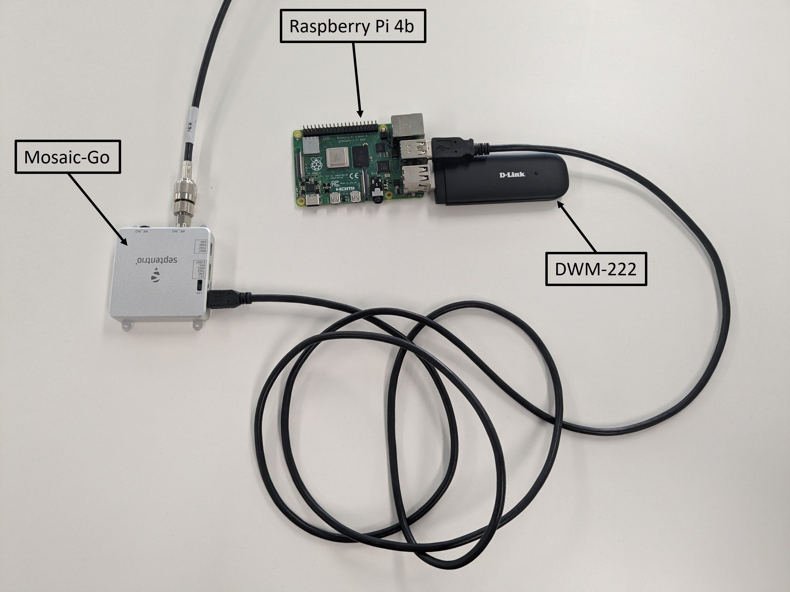
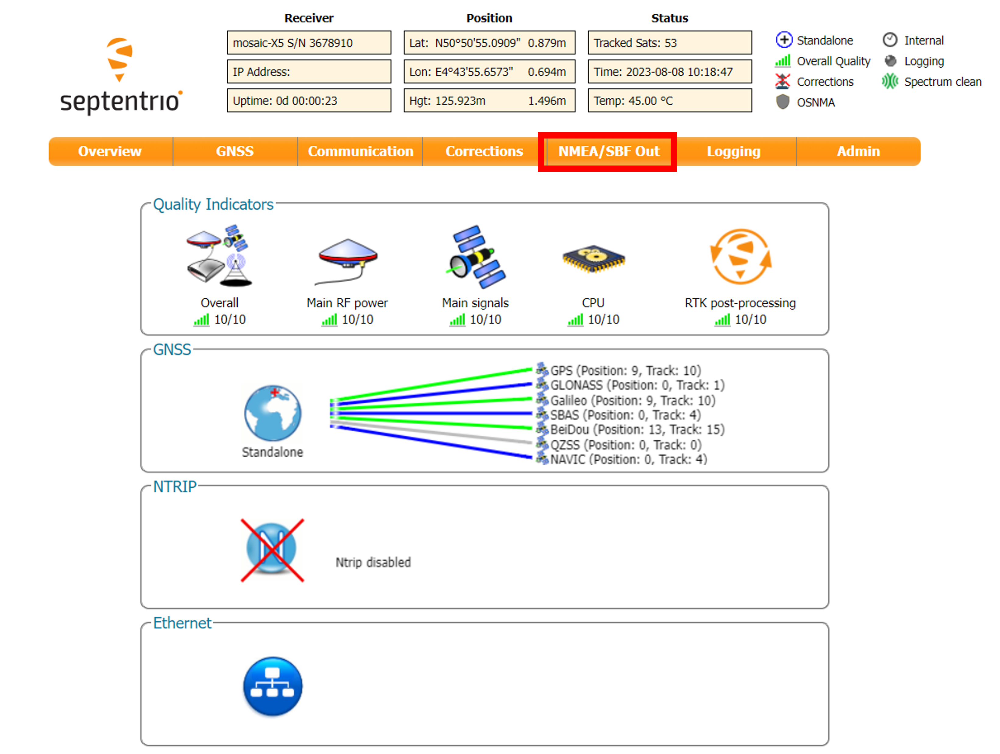
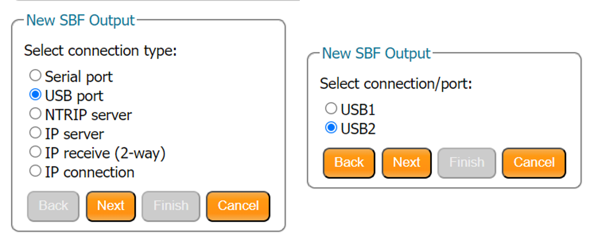
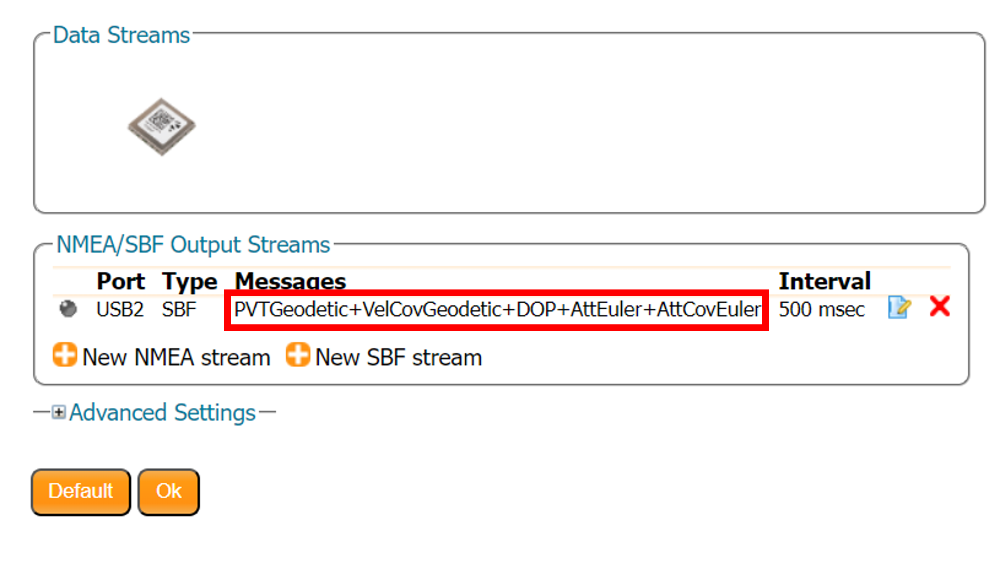

# Getting Started - using 3GPP LPP with Septentrio receiver
This guide aims to deliver comprehensive instructions on the construction and utilization of the 3GPP LPP client alongside a Septentrio GNSS receiver.

---

## Tested setup
The following setup was tested and is confirmed to work with the 3GPP LPP client.
- SBC : Raspberry Pi 4B (OS: Raspberry PI OS 64bit - 2023/05/03)
- GNSS Receiver : Mosaic-Go
- Modem : D-Link DWM-222 (HW Ver: A2, SW Ver: 2.0.1 EU) 

<p align="center">
  
</p>

---

## Prerequisites
The client was tested using Rapsberry Pi OS, but any Linux distribution should work.

To install the required package for building the client, run the following command in a terminal :

```bash
sudo apt install g++ cmake libssl-dev ninja-build
```

---

## Step 1 : Building the client
To build the client using CMake and Ninja, you need to use the following commands :

```bash
cmake -S . -B build -G Ninja
cmake --build build --config Debug
```

Once the building is done, the binary is available over 'build/src/example'.

---

## Step 2 : Receiver setup
Connect the receiver over USB to the Raspberry Pi.
Execute the following command on a terminal:

```bash
ls /dev
```
You should see two peripherals:
- ttyACM0
- ttyACM1

Those two peripherals correspond to the virtual serial ports of the receiver.

Now, we will add an SBF stream output to the receiver. You can do this either over the web interface of the receiver or using the serial interface, depending on your preference or setup.

### Option 1 : Using the serial interface

To facilitate the communication with the receiver using the serial interface, we will use the ttyACM0 interface (USB1) to send commands and the ttyACM1 interface (USB2) for the SBF stream output.

Open the ttyACM0 serial interface using your favorite terminal emulator. We will use *Minicom* in this guide.

Run the following command to open the receiver interface using Minicom.

```bash
sudo minicom -D /dev/ttyACM0
```

Once Minicom is opened, send the following command to set the receiver to command mode:

```
SSSSSSSSSS 
```

You should see "USB1>". Next, send the following command to setup the output the SBF stream on the ttyACM1 port. 


```
setSBFOutput, Stream1, USB2, PVTGeodetic+VelCovGeodetic+DOP+AttEuler+AttCovEuler, msec100
```
Afterwards, you should have an SBF output on the USB2 (ttyACM1) interface. 

### Option 2 : Using the web interface

To access the web interface, open your favorite browser and go to the address http://192.168.3.1.

<p align="center">
  
</p>

Go to the *NMEA/SBF Out* tab. If there are already SBF or NMEA output streams, remove them.
Then click on *New SBF stream*, select *USB port* as the connection type and *USB2* as the connection port.

<p align="center">
  
</p>

Afterwards, select the messages : "PVTGeodetic", "VelCovGeodetic", "DOP", "AttEuler" and "AttCovEuler" from the message list at an interval of 500 msec. Then click on *Finish* and *OK* to confirm the changes.

<p align="center">
  
</p>


## Step 3 : Modem setup
The following setup applies for the D-Link DWM-222 modem but any modem with access to AT-Command over serial should work.
Connect the modem over USB to the Raspberry Pi. 
Execute the following command on a terminal :

```bash
ls /dev
```
You should see 4 peripherals :
- ttyUSB0 (--> DIAG)
- ttyUSB1 (--> AT commands)
- ttyUSB2
- ttyUSB3

>### Modem troubleshoot
>If you don't have access to the ttyUSBx interfaces, it may be that the modem is in "mass-storage" mode.
>
>Execute the following command in a terminal.
>
>```bash
>lsusb
>```
>
>If the modem is connected you should have a "D-Link" device in the list. If the ID of this device is similar to "2001:ab00", then you will have to switch the modem from "mass-storage" mode to modem mode using usb_modeswitch. If the ID is "2001:7e3d", then the modem is already in modem mode.
>
>
>If it is a firmware issue, you will need to update the modem.
>To install the 2.0.1 firmware you will need to use a Windows computer. 
>Go to http://support.dlink.com.au/Download/download.aspx?product=DWM-222 and download the FW2.0.1 exe. Connect the modem to the computer and execute the downloaded file. A terminal will open, follow the instructions. The update should take approximately 10 minutes.


## Step 4 : 3GPP-LPP client usage

The client can be used to provide RTCM OSR corrections to the receiver using the 3GPP LPP protocol over SUPL.

```
  ./src/example COMMAND {OPTIONS}

    SUPL-3GPP-LPP-client v3.2.1 (public)

  OPTIONS:

      -?, --help                        Display this help menu
      -v, --version                     Display version information
      Commands:
        osr                               Request Observation Space
                                          Representation (OSR) data from the
                                          location server.
        ssr                               Request State-space Representation
                                          (SSR) data from the location server.
        agnss                             Request Assisted GNSS data from the
                                          location server.
      Location Server:
        -h[host], --host=[host]           Host
        -p[port], --port=[port]           Port
                                          Default: 5431
        -s, --ssl                         TLS
                                          Default: false
      Identity:
        --msisdn=[msisdn]                 MSISDN
        --imsi=[imsi]                     IMSI
        --ipv4=[ipv4]                     IPv4
      Cell Information:
        -c[mcc], --mcc=[mcc]              Mobile Country Code
        -n[mnc], --mnc=[mnc]              Mobile Network Code
        -t[tac], --lac=[tac], --tac=[tac] Tracking Area Code
        -i[ci], --ci=[ci]                 Cell Identity
      Modem:
        --modem=[device]                  Device
        --modem-baud=[baud_rate]          Baud Rate
      Output:
        File:
          --file=[file_path]                Path
        Serial:
          --serial=[device]                 Device
          --serial-baud=[baud_rate]         Baud Rate
                                            Default: 115200
        I2C:
          --i2c=[device]                    Device
          --i2c-address=[address]           Address
        TCP:
          --tcp=[ip_address]                IP Address
          --tcp-port=[port]                 Port
        UDP:
          --udp=[ip_address]                IP Address
          --udp-port=[port]                 Port
        Stdout:
          --stdout                          Stdout
```